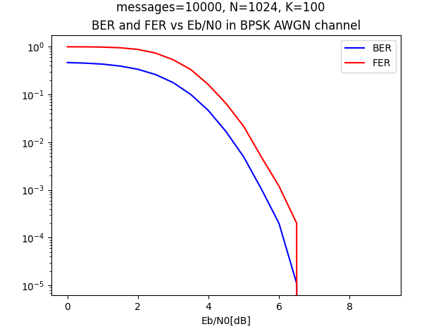

# polar-ed

## Table of contents
* [Introduction](#Introduction)
* [Technologies](#Technologies)
* [Usage](#Usage)
* [Results](#Results)
* [Bibliography](#Bibliography)


## Introduction
Simple implementation of polar encoder and successive cancelation polar decoder.
More information about polar codes [here](https://www.canva.com/design/DAFnqFS9VZs/cgDmy03AyVrw2ucreaql-Q/edit?utm_content=DAFnqFS9VZs&utm_campaign=designshare&utm_medium=link2&utm_source=sharebutton)
and [here](https://archive.nptel.ac.in/courses/117/106/108106137/).
## Technologies
* matplotlib 3.7.1
* numpy 1.24.3

## Usage

Firstly, install requirements:
```
pip install -r requirements.txt
```
Then, simply run main function. Program will create random massages, encode them, 
send them through AWGN BPSK channel and finally decode. Graph of 
BER and FER vs E<sub>b</sub>/ N<sub>0</sub> will be shown.

## Results
Ready graph should look like this:  



## Bibliography
* Erdel Arikan *Channel Polarization: A Method for Constructing
Capacity-Achieving Codes for Symmetric Binary-Input Memoryless Channels*
* Tomasz Lejkowski, *Implementation of a Polar Code* (March 2022)
* Pascal Giard, Claude Thibeault, Warren J. Gross *High-Speed Decoders for Polar Codes*
* Orhan Gazi *Polar Codes. A Non-Trivial Approach to Channel Coding*
* LDPC and Polar Codes in 5G Standard, Indian Institute of Technology in Madras
